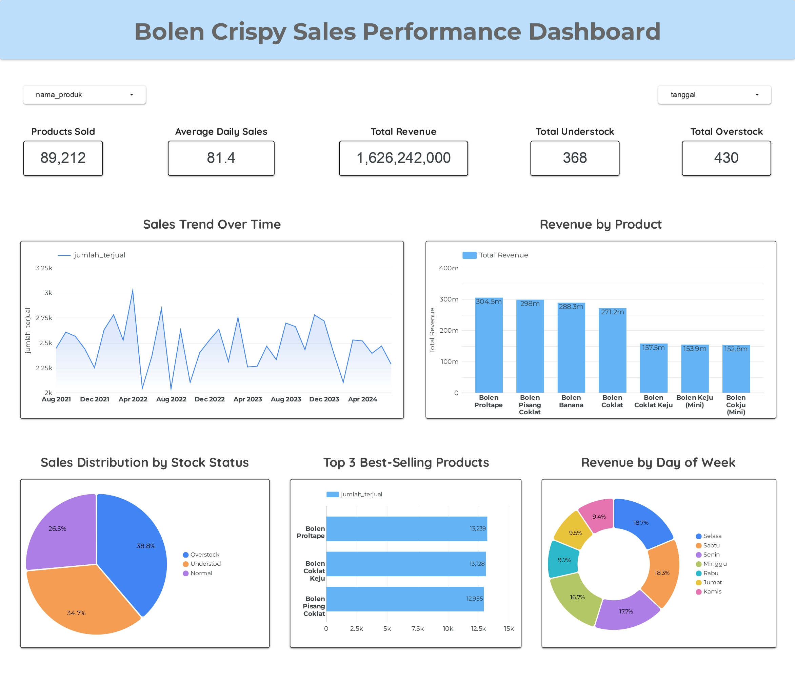

# Bolen Crispy Sales and Inventory Analysis Using SQL
This is a Data Analyst project focused on analyzing sales performance and inventory management using SQL and dashboard visualization.

## 1. Background
Bisnis Bolen Crispy merupakan usaha di bidang makanan yang menjual berbagai varian produk bolen kepada pelanggan. Seiring dengan meningkatnya transaksi penjualan, diperlukan analisis data yang tepat untuk memahami performa bisnis secara menyeluruh. Saat ini, data penjualan yang tersedia masih berupa data mentah (raw data) dan belum dimanfaatkan secara maksimal untuk menghasilkan insight yang dapat membantu pengambilan keputusan. Hal ini dapat menyebabkan beberapa permasalahan, seperti:

- Tidak diketahui produk mana yang paling laris dan paling sedikit terjual
- Sulit memantau tren penjualan dari waktu ke waktu
- Kurangnya visibilitas terhadap kondisi stok (apakah understock, normal, atau overstock)
- Risiko kehabisan stok pada produk dengan permintaan tinggi
- Penumpukan stok pada produk yang kurang diminati

Oleh karena itu, diperlukan analisis data menggunakan SQL untuk mengolah data penjualan menjadi informasi yang lebih terstruktur dan bermakna. Selain itu, hasil analisis akan divisualisasikan dalam bentuk dashboard agar lebih mudah dipahami dan digunakan oleh stakeholder.

Melalui project ini, dilakukan proses analisis terhadap data penjualan dan stok untuk menghasilkan insight yang dapat membantu meningkatkan performa bisnis serta mendukung pengambilan keputusan berbasis data (data-driven decision making).

## 2. Tujuan
Tujuan dari project ini adalah untuk menganalisis data penjualan dan stok pada bisnis Bolen Crispy untuk menghasilkan insight yang dapat mendukung pengambilan keputusan berbasis data. Adapun tujuan utama dari analisis ini meliputi:

- Menganalisis performa penjualan secara keseluruhan, termasuk total penjualan dan revenue
- Mengidentifikasi produk terlaris (top-selling) dan produk dengan penjualan rendah (slow-moving)
- Menganalisis tren penjualan berdasarkan waktu (harian, mingguan, atau periode tertentu)
- Mengevaluasi kondisi stok dengan mengklasifikasikan status stok menjadi understock, normal, dan overstock
- Menyajikan hasil analisis dalam bentuk dashboard agar mudah dipahami oleh pengguna

## 3. Dataset
Dataset yang digunakan dalam project ini merupakan data penjualan produk Bolén Crispy yang berisi informasi terkait transaksi, produk, harga, dan stok. 
Adapun kolompada dataset awal meliputi:

- Tanggal → menunjukkan waktu terjadinya transaksi penjualan
- Hari → informasi hari dari setiap transaksi (Senin–Minggu)
- Nama Produk → jenis produk bolen yang dijual
- Jumlah Terjual → jumlah unit produk yang terjual
- Harga Satuan → harga per unit produk
- Stok Produk → jumlah stok yang tersedia

## 4. Tools
- SQL (MySQL)
- Looker Studio (Dashboard)
- Microsoft Excel

## 5. Data Analysis Process
Pada project ini, proses analisis data dilakukan menggunakan SQL untuk mengolah dataset menjadi insight yang informatif dan siap divisualisasikan dalam dashboard. Tahapan analisis yang dilakukan meliputi:

1. Data Aggregation & Exploration

Melakukan agregasi data untuk memahami gambaran umum performa penjualan, hal ini bertujuan untuk mengetahui produk mana yang paling berkontribusi terhadap bisnis.

- Total penjualan dan total revenue
- Penjualan dan revenue per produk
- Rata-rata penjualan harian per produk

2. Time Series Analysis

Melakukan analisis berbasis waktu untuk mengidentifikasi pola dan tren penjualan, meliputi:

- Tren penjualan harian (daily sales trend)
- Tren revenue harian (daily revenue trend)
- Tren penjualan tahunan (yearly sales trend)

3. Product Performance Analysis

Menganalisis performa masing-masing produk untuk mendukung pengambilan keputusan bisnis. Insight dari analisis ini dapat digunakan untuk strategi promosi dan pengelolaan produk.

- Produk terlaris (top 3 best-selling products)
- Produk dengan penjualan terendah (slow-moving products)
- Performa produk berdasarkan hari (top-selling products by day)

4. Sales Pattern Analysis

Mengidentifikasi pola perilaku penjualan berdasarkan waktu. Analisis ini membantu bisnis dalam menentukan strategi operasional dan promosi pada waktu tertentu.

- Penjualan berdasarkan hari dalam seminggu
- Perbandingan penjualan antara weekday dan weekend

5. Feature Engineering & Stock Analysis

Melakukan transformasi data dengan membuat kolom turunan untuk analisis inventori:

- Sisa Stok → dihitung dari `stok_produk` - `jumlah_terjual`
- Status Stok → diklasifikasikan menjadi:
  - Understock → stok habis atau kurang
  - Normal → stok dalam kondisi aman
  - Overstock → stok berlebih

Proses ini menggunakan logika CASE WHEN dalam SQL dan bertujuan untuk mengevaluasi efisiensi pengelolaan stok serta mengidentifikasi potensi risiko dalam inventori.

## 6. Key Analysis (SQL Highlight)
Berdasarkan hasil analisis menggunakan SQL, diperoleh beberapa insight utama yang dapat membantu dalam memahami performa penjualan serta pengelolaan stok pada bisnis Bolén Crispy:

1. Tren Penjualan dan Revenue

Analisis menunjukkan adanya fluktuasi penjualan harian yang berdampak langsung pada revenue. Dengan memahami pola ini, bisnis dapat mengantisipasi periode dengan permintaan tinggi maupun rendah.

2. Kontribusi Produk terhadap Revenue

Tidak semua produk memberikan kontribusi yang sama terhadap total revenue. Beberapa produk menjadi penyumbang utama penjualan, sehingga perlu diprioritaskan dalam strategi bisnis seperti promosi dan pengelolaan stok.

3. Identifikasi Produk Terlaris dan Slow Moving

Ditemukan adanya perbedaan signifikan antara produk terlaris (best-selling) dan produk dengan penjualan rendah (slow-moving).

- Produk terlaris berpotensi untuk ditingkatkan produksinya
- Produk slow-moving perlu dievaluasi, baik dari segi harga, promosi, maupun keberlanjutannya
4. Pola Penjualan Berdasarkan Hari

Penjualan menunjukkan variasi berdasarkan hari dalam seminggu. Selain itu, terdapat perbedaan performa antara weekday dan weekend, yang dapat dimanfaatkan untuk menentukan strategi pemasaran dan operasional.

## 7. Dashboard
 

## 8. Business Recomendation

